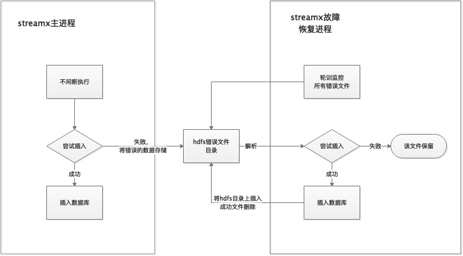

当streamx写入目标源的时候，如hive，可能会遇到目标库的列和配置写入的列不对齐的情况，这样插入数据会失败。

当遇到这种情况的时候，将插入失败的kafka的原始数据dump一份到指定的hdfs目录下留存。

有了元数据感知机制，服务可以实时更新最新的配置。同时streamx的故障恢复进程(streamx failover)会轮询hdfs目录下的失败dump文件，使用实时更新的配置来重新尝试插入，若插入成功就删除失败dump文件，失败的话继续尝试插入。

目前支持容错机制的写入：hive

streamx容错示意图

