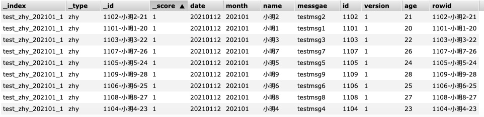
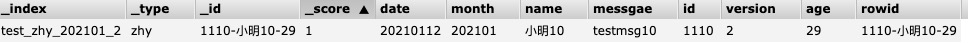

# kafka->es配置

## 1 配置
```
{
  "params": {
    "batchDuration": "10"
  },
  "configs": [
    {
      "reader": {
        "name": "",
        "brokerList": "33.69.6.13:9092,33.69.6.14:9092,33.69.6.15:9092,33.69.6.16:9092,33.69.6.17:9092,33.69.6.18:9092,33.69.6.19:9092,33.69.6.20:9092,33.69.6.21:9092,33.69.6.22:9092",
        "topic": "test_zhy",
        "groupId": "test_zhy_0128_1",
        "extraConfigs": "auto.offset.reset:latest",
        "parser": "json"
      },
      "writers": [
        {
          "name": "com.zhy.streamx.elastic.writer.ElasticWriter",
          "url": "33.69.6.95:9221,33.69.6.96:9221,33.69.6.97:9221,33.69.6.98:9221",
          "index": "test_zhy_{0}_{1}",
          "partitionValue": "month,version",
          "type": "zhy",
          "batchSize": 1000,
          "hasId": true
        }
      ],
      "transformer": {
        "reader_fields": {
          "id": {
            "type": "string"
          },
          "name": {
            "type": "string"
          },
          "age": {
            "type": "int"
          },
          "messgae": {
            "type": "string"
          },
          "date": {
            "type": "string"
          },
          "version": {
            "type": "int"
          }
        },
        "writer_fields": [
          "concat(id,'-',name,'-',age) as rowid",
          "*",
          "concat(substr(date,1,4),substr(date,5,2)) as month"
        ]
      }
    }
  ]
}
```

## 2 配置详解

## 3 模拟数据

1. kafka数据准备

data1
```
{"id":"1101","name":"小明1","age":20,"messgae":"testmsg1","date":"20210112","version":1}
{"id":"1102","name":"小明2","age":21,"messgae":"testmsg2","date":"20210112","version":1}
{"id":"1103","name":"小明3","age":22,"messgae":"testmsg3","date":"20210112","version":1}
{"id":"1104","name":"小明4","age":23,"messgae":"testmsg4","date":"20210112","version":1}
{"id":"1105","name":"小明5","age":24,"messgae":"testmsg5","date":"20210112","version":1}
{"id":"1106","name":"小明6","age":25,"messgae":"testmsg6","date":"20210112","version":1}
{"id":"1107","name":"小明7","age":26,"messgae":"testmsg7","date":"20210112","version":1}
{"id":"1108","name":"小明8","age":27,"messgae":"testmsg8","date":"20210112","version":1}
{"id":"1109","name":"小明9","age":28,"messgae":"testmsg9","date":"20210112","version":1}
{"id":"1110","name":"小明10","age":29,"messgae":"testmsg10","date":"20210112","version":2}
```

2. kafka生产数据

```
./bin/kafka-console-producer.sh --broker-list 33.69.6.13:9092 --topic test_zhy < data1
```

## 4 数据验证

数据验证后写到了指定索引，且索引分区。

```
curl -XPOST http://33.69.6.95:9221/test_zhy_202101_1/zhy/_search                                                                  
curl -XPOST http://33.69.6.95:9221/test_zhy_202101_2/zhy/_search                                                                  
```





